# Projektdokumentation – EventRide

## Inhaltsverzeichnis

1. [Ausgangslage](#1-ausgangslage)
2. [Lösungsidee](#2-lösungsidee)
3. [Vorgehen & Artefakte](#3-vorgehen--artefakte)
    1. [Understand & Define](#31-understand--define)
    2. [Sketch](#32-sketch)
    3. [Decide](#33-decide)
    4. [Prototype](#34-prototype)
    5. [Validate](#35-validate)
4. [Erweiterungen](#4-erweiterungen)
5. [Projektorganisation](#5-projektorganisation)
6. [KI-Deklaration](#6-ki-deklaration)
7. [Anhang](#7-anhang)

---

## 1. Ausgangslage

**Problem:** Wer ein Konzert, ein Festival oder einen Sportanlass besucht, steht oft vor demselben Problem: Die öffentlichen Verkehrsmittel fahren zu ungünstigen Zeiten, das Parkplatzangebot ist begrenzt, und gemeinsam mit anderen hinzufahren ist organisatorisch aufwändig. Gleichzeitig gibt es viele Personen, die mit dem Auto zum gleichen Event unterwegs wären und freie Plätze haben – aber keine einfache Möglichkeit, sich zu koordinieren.

Bestehende Mitfahr-Apps (z. B. BlaBlaCar) sind auf längere Strecken ausgelegt und nicht auf den spezifischen Kontext von Events zugeschnitten. Eine zielgruppengerechte Lösung für junge Menschen in der Schweiz, die Events gemeinsam besuchen wollen, fehlt.

**Ziele:**
- Mitfahrgelegenheiten zu Events einfach anbieten und finden
- Fahrer und Mitfahrende effizient zusammenbringen
- Abholort, Route und Zeiten transparent kommunizieren
- Eine vertrauenswürdige und sichere Interaktion ermöglichen
- Als mobil-first Webanwendung ohne App-Download nutzbar sein

**Primäre Zielgruppe:** Junge Erwachsene (18–30 Jahre) in der Deutschschweiz, die regelmässig Festivals, Konzerte, Sportveranstaltungen oder Kulturevents besuchen und dabei mobil flexibel sein möchten.

**Weitere Stakeholder:** Eventveranstalter (indirekt), die von einer höheren Besucherquote durch erleichterte Anreise profitieren könnten.

---

## 2. Lösungsidee

EventRide ist eine mobiloptimierte Webanwendung, die es ermöglicht, Mitfahrgelegenheiten zu Events anzubieten und zu buchen.

**Kernfunktionalität:**
- **Event-Feed:** Nutzer sehen auf der Startseite aktuelle Mitfahrangebote, gefiltert nach Kategorie und Abholort
- **Fahrt anbieten:** Fahrende geben Start, Ziel, Abfahrtszeit, freie Plätze und Preis an; eine Routenvorschau wird direkt auf einer Karte dargestellt
- **Mitfahrt anfragen:** Interessierte wählen einen Abholort und senden eine Anfrage; der Fahrer erhält eine Benachrichtigung
- **Anfragen verwalten:** Fahrende nehmen Anfragen an oder lehnen sie ab; akzeptierte Mitfahrende erhalten eine bestätigte Abholzeit
- **Chat:** Fahrer und Mitfahrende können direkt miteinander kommunizieren
- **Bewertungssystem:** Nach der Fahrt können sich beide Seiten gegenseitig bewerten
- **Benachrichtigungen:** Wichtige Statusänderungen werden als In-App-Notifications angezeigt

**Annahmen:**
- Nutzer sind bereit, eine kurze Anmeldung vorzunehmen
- Vertrauen entsteht durch Bewertungen und transparente Informationen
- Chat-Kommunikation ist für die Koordination ausreichend

**Abgrenzung:**
- Kein echtes Zahlungssystem (Preise dienen der Kostentransparenz)
- Keine native mobile App (Browser-App / PWA)
- Kein Live-Tracking der Fahrt

---

## 3. Vorgehen & Artefakte

### 3.1 Understand & Define

**Zielgruppenverständnis:**

In der Analyse-Phase wurde die Lebenssituation der Zielgruppe betrachtet. Junge Erwachsene in der Schweiz besuchen regelmässig Events, sind aber auf Pendlerstrecken oder in ländlichen Regionen oft auf das Auto angewiesen. Öffentliche Verkehrsmittel sind nach Mitternacht eingeschränkt, und die Parkplatzsituation bei grossen Events ist belastet. Die Zielgruppe ist technikaffin und nutzt Smartphones intensiv.

**Wesentliche Erkenntnisse:**
- Die Koordination erfolgt aktuell über WhatsApp-Gruppen oder Zufall – ein strukturiertes Angebot fehlt
- Vertrauen ist zentral: Nutzer möchten wissen, mit wem sie fahren
- Die Abhollogistik (wann, wo, wie lange warten) ist eine häufige Fehlerquelle
- Eventbezug ist entscheidend: Die Mitfahrt wird als Teil des Erlebnisses gesehen, nicht als reines Transportmittel
- Mobile Nutzung steht im Vordergrund

**Proto-Persona:** *Lena, 23, Studentin in Zürich.* Besucht 5–8 Festivals pro Jahr, hat keinen eigenen Wagen, organisiert Fahrten aktuell über Instagram und WhatsApp. Wünscht sich Transparenz über Abholzeit und Mitfahrende.

---

### 3.2 Sketch

In der Sketch-Phase wurden verschiedene Ansätze für die Hauptflows skizziert:

**Variante A – Liste + Detailansicht (klassisch):**
Einfacher vertikaler Feed mit Ride Cards; Detailseite mit Buchungs-CTA. Orientiert sich an bekannten App-Mustern (AirBnB, BlaBlaCar).

**Variante B – Detaillierter Flow mit Zwischenstopps und Filteroptionen:**
Erweiterte Ansicht mit Radius-Filter, verifizierten Mitfahrern, Kalenderfunktion und automatischer Fahrt-Erstellung per Ticket-Scan.

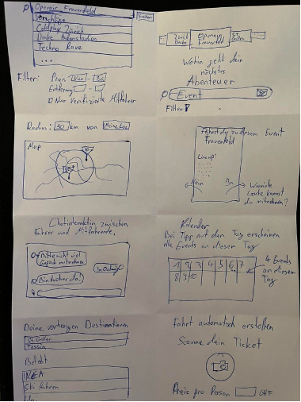
*Erste Ideenskizzen: verschiedene UI-Konzepte für Feed, Kartenansicht, Chat und Fahrt-Erstellung*

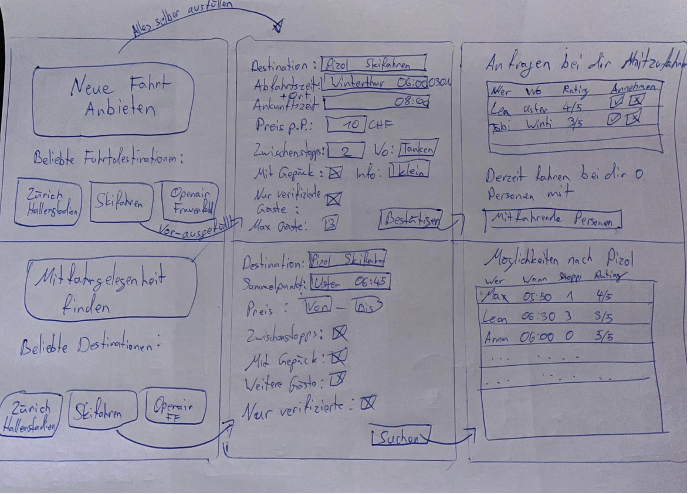
*Detaillierte Flows: „Neue Fahrt anbieten" und „Mitfahrgelegenheit finden" mit Formularfeldern und Ergebnisliste*

**Variante C – Event-first:**
Nutzer suchen zuerst das Event, dann passende Fahrten dazu. Stärkt den Eventbezug, erfordert aber eine kuratierte Eventdatenbank.

**Entscheid für Weiterentwicklung:** Variante A mit Elementen aus Variante C. Der Feed bleibt listenbasiert für einfache mobile Bedienbarkeit; der Eventkontext wird durch Kategorien und Eventbilder hergestellt. Die Karte erscheint nur wo sie Mehrwert bietet (Fahrt erstellen, Routenvorschau).

---

### 3.3 Decide

**Gewählte Variante:** Event-Feed mit Card-basierter Liste, ergänzt durch einen personalisierten Abholort-Widget auf der Startseite.

**Begründung:** Listenbasierte Darstellung ist auf Mobilgeräten am effizientesten zu bedienen. Die Personalisierung durch den Abholort gibt den Fahrten einen unmittelbaren Bezug zur eigenen Situation.

**End-to-End-Ablauf (User Journey):**

1. Nutzer öffnet EventRide → sieht Event-Feed
2. Setzt optional einen Abholort → personalisierte Zeiten werden angezeigt
3. Findet eine passende Fahrt → öffnet Detailseite
4. Bucht Mitfahrt: gibt Abholort an, stimmt Fairplay-Regeln zu
5. Fahrer sieht Anfrage in Inbox → nimmt an oder lehnt ab
6. Bei Annahme: Mitfahrer erhält bestätigte Abholzeit und kann per Chat Kontakt aufnehmen
7. Nach der Fahrt: gegenseitige Bewertung möglich

**Mockup:** Wireframes wurden als Low-Fidelity-Skizzen erstellt und anschliessend in ein interaktives High-Fidelity-Mockup überführt.

**Mockup-URL (Figma):** https://www.figma.com/design/4jLaSPfl2VyuU7e90qlw60/Prototyping-%C3%9Cbung-10-Klodian-Elshani?node-id=0-1&t=xZOVPIsLPWbwsvan-

Die folgenden Screenshots zeigen die wichtigsten Screens des Mockups:

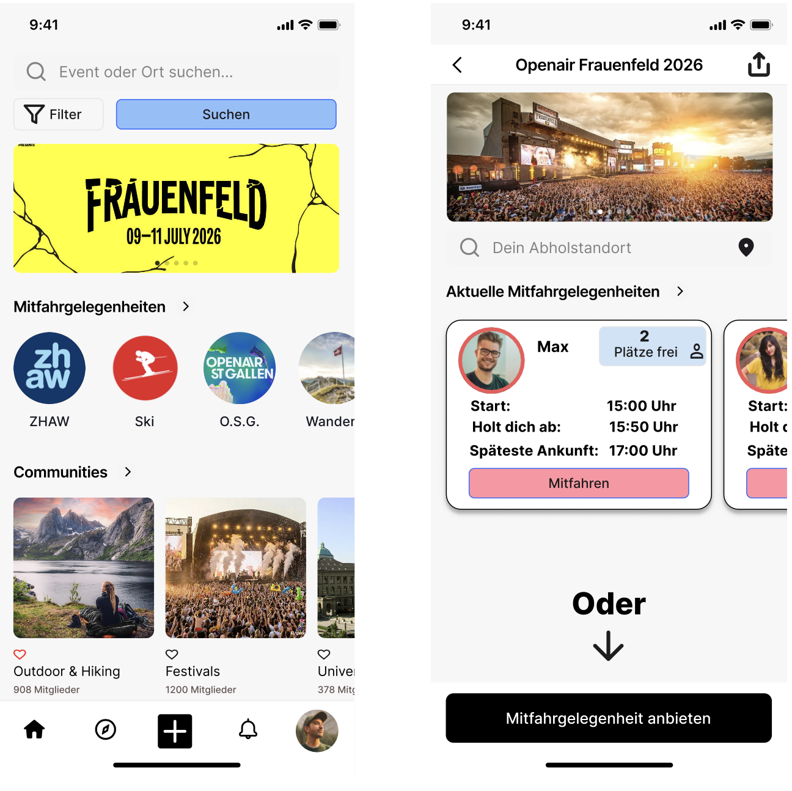
*Startseite mit Event-Feed (links) und Buchungsflow – Abholort-Eingabe und Bestätigungsscreen (rechts)*

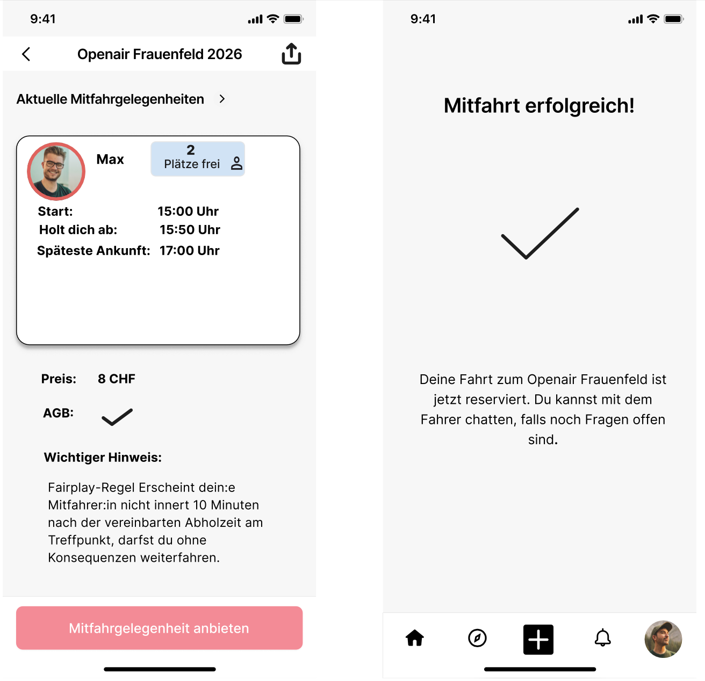
*Buchungsflow: Mitfahrt anfragen (links) und Bestätigungsscreen „Anfrage gesendet!" (rechts)*

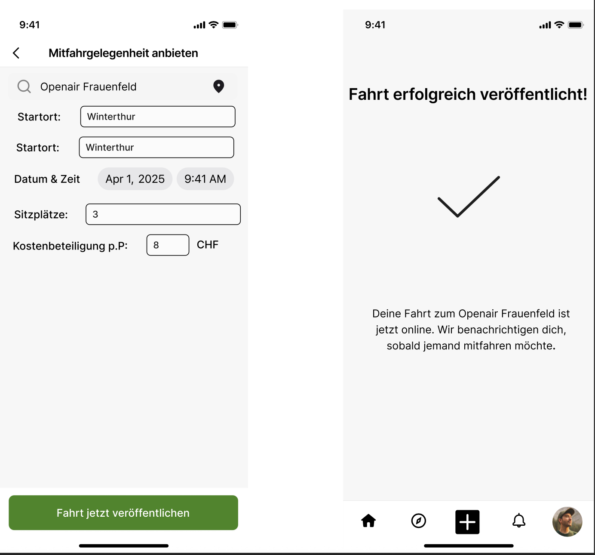
*Fahrt anbieten: Eingabeformular mit Kategorieauswahl, Startort und Zeitangaben*

---

### 3.4 Prototype

#### 3.4.1 Entwurf (Design)

**Informationsarchitektur:**

Die App ist als Single-Page-Application mit fünf Hauptbereichen strukturiert:

| Bereich | Inhalt |
|---------|--------|
| Home | Event-Feed, Abholort-Widget, Kategoriefilter |
| Suche | Textsuche, Kategorieentdeckung, Suchverlauf |
| Erstellen | Fahrt anbieten (FAB-Button) |
| Inbox | Anfragen, Benachrichtigungen, Chats |
| Profil | Eigene Fahrten, Buchungen, Bewertungen, Einstellungen |

Die Navigation erfolgt über eine fixierte Bottom Navigation Bar mit Badge-Anzeigen für ungelesene Inhalte.

**User Interface Design:**

- **Farbsprache:** Primärfarbe Rot/Rose (Energie, Mobilität) auf weissem Grund; Grautöne für Sekundärinhalte
- **Typografie:** System-Schriften; klare Hierarchie zwischen Titel, Label und Hilfstexten
- **Cards:** Ride Cards mit Event-Bild im Header, Fahrer-Info, Zeitangabe und Buchungs-CTA
- **Feedback:** Toast-Nachrichten für wichtige Aktionen; Badge-Indikatoren auf Navigations-Icons

Die folgenden Screenshots zeigen die wichtigsten Screens des Prototyps:

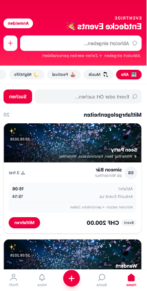
*Startseite: Event-Feed mit Kategoriefilter und personalisierten Abholzeiten (EventRide v2)*

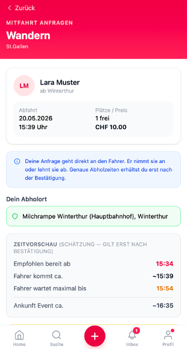
*Buchungsanfrage: Detailseite mit Zeitvorschau „Spätestens abholbereit" und Abholort-Eingabe*

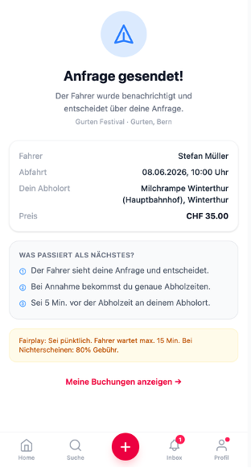
*Buchungsbestätigung: „Anfrage gesendet!" mit Fahrer-Info, Preis und Next-Steps-Hinweisen*

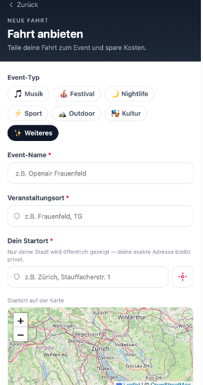
*Fahrt anbieten: Formular mit Kategorieauswahl, Event-Name, Startort und Leaflet-Kartenvorschau*

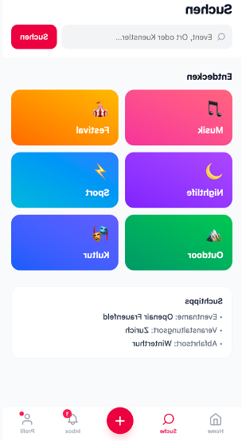
*Suchseite: Kategorieentdeckung und Suchfeld für Events, Orte und Künstler*

**Designentscheidungen:**
- Mobiloptimierung: max-width 430px, Safe-Area-Padding für iOS/Android
- Keine externe Icon-Bibliothek: Inline SVG für Performance
- Lazy-Loading der Event-Bilder via Unsplash CDN
- Dunkler Header auf der Startseite für höhere visuelle Wirkung

#### 3.4.2 Umsetzung (Technik)

**Technologie-Stack:**

| Schicht | Technologie |
|---------|-------------|
| Framework | SvelteKit 5 (Runes-Modus) |
| Styling | Tailwind CSS v4 |
| Datenbank | MongoDB Atlas (Cloud) |
| Karten | Leaflet.js |
| Routing/ETA | OSRM (Project-OSRM API) |
| Geocoding | Nominatim (OpenStreetMap), Photon API (Komoot) |
| Deployment | Netlify (adapter-netlify) |
| Auth | Session-basiert (UUID-Token, 7 Tage) |

**Tooling:**
- IDE: Visual Studio Code
- Versionskontrolle: Git / GitHub
- Paketmanager: npm
- Deployment: Netlify CLI

**Struktur & Komponenten:**

```
src/
  lib/
    components/       RideCard, BookingCard, BottomNav, ToastContainer
    routing.ts        OSRM-Integration + 30%-Reisezeitpuffer
    ride-planner.ts   Multi-Stop-Routenplanung
    dto.ts            Privacy-sichere Data Transfer Objects
    booking-actions.server.ts  Buchungslogik
    cancellation-policy.ts     Stornogebühren-Berechnung
    notifications.server.ts    Notification-Erstellung
  routes/
    (home)            Event-Feed
    rides/[id]/       Fahrtdetail, Buchung, Bewertung
    inbox/            Anfragen, Benachrichtigungen, Chats
    my/               Eigene Fahrten, Buchungen, Profil
    admin/            Nutzerverwaltung (Admin-only)
    api/              Route-Proxy, Event-Autosuggest
```

**Daten & Schnittstellen:**

MongoDB-Collections: `rides`, `bookings`, `users`, `sessions`, `conversations`, `messages`, `notifications`, `ratings`

Privacy-Prinzip: Exakte Startadressen werden nie an den Client gesendet. Das `PublicRideDTO` enthält nur stadtgenaue Koordinaten für die clientseitige Vorschau.

**Deployment:**
- Prototyp (eingefroren): https://eventride-prototype.netlify.app
- Verbesserte Version (v2 Hauptversion): https://eventride-v2.netlify.app

**Besondere Entscheidungen:**
- Abholzeiten werden erst bei Annahme durch den Fahrer berechnet (nicht bei Anfrage)
- 30%-Puffer auf alle Fahrzeiten für realistischere ETAs (`TRAVEL_BUFFER_FACTOR = 1.3`)
- Atomarer Sitz-Abzug via MongoDB `$inc` mit Bedingung zur Vermeidung von Race Conditions

---

### 3.5 Validate

**URL der getesteten Version:** https://eventride-prototype.netlify.app

**Ziele der Prüfung:**
- Können Nutzende ohne Erklärung eine Mitfahrt buchen?
- Ist der Abholort-Widget verständlich und bedienbar?
- Werden Anfragen und Benachrichtigungen als Fahrer wahrgenommen?
- Welche Elemente sind unklar oder fehlen?

**Vorgehen:** Moderierte Usability-Tests, durchgeführt vor Ort (on-site) mit Think-Aloud-Methode.

**Stichprobe:** 2 Testpersonen aus der Zielgruppe (junge Erwachsene, 20–25 Jahre, regelmässige Eventbesucher).

**Aufgaben / Szenarien:**

1. *Du möchtest zum Openair Frauenfeld. Finde eine passende Mitfahrgelegenheit und buche sie.*
2. *Du bietest eine Fahrt zum Street Parade an. Erstelle ein Angebot.*
3. *Du hast eine Mitfahranfrage erhalten. Nimm sie an.*
4. *Wo siehst du, ob deine Anfrage angenommen wurde?*
5. *Du möchtest mit dem Fahrer eine Frage klären. Wie gehst du vor?*

**Kennzahlen & Beobachtungen:**

| Aufgabe | Erfolg | Beobachtung |
|---------|--------|-------------|
| Mitfahrt buchen | ✓ | Abholort-Eingabe wurde kurz übersehen |
| Fahrt erstellen | ✓ | Routenvorschau wurde positiv kommentiert |
| Anfrage annehmen | ✓ | Inbox wurde ohne Hinweis gefunden |
| Buchungsstatus prüfen | ✓/✗ | Statusbadge nicht sofort gefunden |
| Chat öffnen | ✓ | Link im Buchungsdetail wurde als intuitiv bewertet |

**Zusammenfassung der Resultate:**
Die Kernflows wurden von beiden Testpersonen erfolgreich durchgeführt. Als grösste Schwierigkeit erwies sich die Sichtbarkeit des Buchungsstatus. Der Abholort-Widget wurde positiv wahrgenommen, war aber beim ersten Durchgang nicht sofort als interaktiv erkennbar. Die Routenvorschau beim Erstellen wurde als nützlich bewertet.

**Abgeleitete Verbesserungen:**

| Priorität | Verbesserung | Begründung |
|-----------|-------------|------------|
| Hoch | Zeitlabel „Empfohlen bereit ab" → „Spätestens abholbereit" | Formulierung war unklar |
| Hoch | Vergangene Fahrten aus Feed entfernen | Verwirrt Nutzende |
| Mittel | Routenfilter standardmässig aktiv wenn Abholort gesetzt | Relevanzerhöhung |
| Mittel | Abholort-Widget als interaktiv kenntlicher machen | Wird als statisch missverstanden |

*Die höchstprioritären Verbesserungen wurden in der Version v2 umgesetzt (Kap. 4).*

---

## 4. Erweiterungen

### 4.1 Spätestens abholbereit – Zeitlogik korrigiert
- **Beschreibung & Nutzen:** Label „Empfohlen bereit ab" → „Spätestens abholbereit" mit korrekter semantischer Bedeutung. Zusätzlich 30%-Reisezeitpuffer für realistischere ETAs.
- **Wo umgesetzt:** Frontend `BookingCard.svelte`, Backend `routing.ts`
- **Referenz:**
  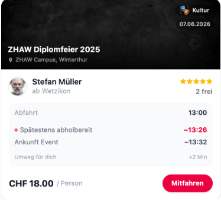
  *Buchungsscreen mit korrigiertem Label „Spätestens abholbereit" und realistischer Abholzeit-Berechnung*
- **Aus Evaluation abgeleitet?:** Ja

### 4.2 Vergangene Fahrten aus öffentlichem Feed
- **Beschreibung & Nutzen:** Fahrten nach Abfahrtszeit nicht mehr öffentlich sichtbar. Reduziert Verwirrung.
- **Wo umgesetzt:** `+page.server.ts`, `search/+page.server.ts`, `rides/[id]/+page.server.ts` – MongoDB-Filter `departureTime: { $gt: new Date() }`
- **Referenz:**
  
  *Startseite: Der Feed zeigt ausschliesslich zukünftige Fahrten; abgelaufene Events werden herausgefiltert*
- **Aus Evaluation abgeleitet?:** Ja

### 4.3 Routenvorschau und Zwischenstopps
- **Beschreibung & Nutzen:** Beim Erstellen wird die Route als Leaflet-Polyline angezeigt. Optionale Zwischenstopps werden in die OSRM-Berechnung einbezogen.
- **Wo umgesetzt:** `rides/new/+page.svelte`, `rides/new/+page.server.ts`, `api/route/+server.ts`
- **Referenz:**
  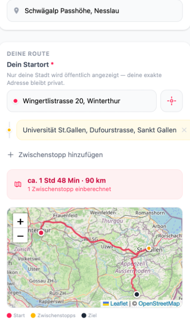
  *Fahrt anbieten: Die Route wird nach Eingabe von Start und Ziel als Polyline auf der Leaflet-Karte dargestellt*
- **Aus Evaluation abgeleitet?:** Teilweise (Routenvorschau war positives Feedback; Zwischenstopps als Ergänzung)

### 4.4 20-Minuten-Detour-Filter
- **Beschreibung & Nutzen:** Toggle filtert Fahrten mit Umweg >20 Min heraus. Standardmässig aktiv wenn Abholort gesetzt.
- **Wo umgesetzt:** `+page.svelte` (clientseitige Haversine-Berechnung)
- **Referenz:**
  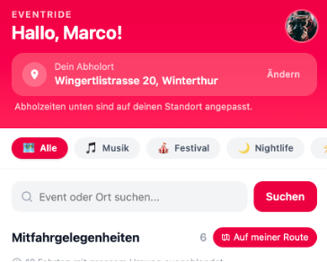
  *Feed mit aktivem Detour-Filter: Fahrten mit zu grossem Umweg werden automatisch ausgeblendet*
- **Aus Evaluation abgeleitet?:** Teilweise

### 4.5 Event-Autosuggest beim Erstellen
- **Beschreibung & Nutzen:** Beim Eingeben des Eventnamens werden Vorschläge aus der DB angezeigt (Debounce 250ms).
- **Wo umgesetzt:** `rides/new/+page.svelte`, `api/events/+server.ts`
- **Referenz:**
  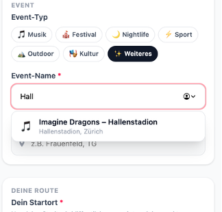
  *Fahrt erstellen: Beim Tippen des Eventnamens erscheinen passende Vorschläge aus der Datenbank als Dropdown*
- **Aus Evaluation abgeleitet?:** Nein


---

## 5. Projektorganisation

- **Repository:** https://github.com/klodianels-sketch/event-ride
- **Struktur:** Monorepo mit SvelteKit-Standardstruktur; `README.md` im Root
- **Issue-Management:** Aufgaben und Verbesserungen wurden als priorisierte Aufgabenlisten geführt und phasenweise abgearbeitet. Grössere Funktionen (z. B. Routenvorschau, Notification-System, Admin-Panel) wurden als eigenständige Entwicklungseinheiten geplant und gebündelt committed. Issues aus der Evaluation wurden direkt in die Entwicklungsplanung von v2 übernommen.
- **Commits:** Conventional Commits (`feat:`, `fix:`, `chore:`) mit sprechenden Nachrichten; pro Entwicklungsphase ein gebündelter Commit
- **Branches:**
  - `prototype` – Basisversion → https://eventride-prototype.netlify.app
  - `main` – v2 → https://eventride-v2.netlify.app

---

## 6. KI-Deklaration

### 6.1 KI-Tools

**Eingesetzte Tools:**
- **Claude Code (Anthropic)** – claude-sonnet-4-6, über die Claude Code CLI

**Zweck & Umfang:**

| Bereich | KI-Unterstützung | Gewicht |
|---------|-----------------|---------|
| Svelte-Komponenten (UI) | Code-Generierung auf Basis von Anforderungsbeschreibungen | Hoch |
| SvelteKit Server-Logik (Actions, Load) | Code-Generierung und Fehlerkorrektur | Hoch |
| MongoDB-Abfragen | Aggregations-Pipelines, Abfragestruktur | Mittel |
| Routing & ETA-Berechnung | Logik-Entwurf und Umsetzung | Mittel |
| Seed-Daten | Generierung realistischer Testdaten | Mittel |
| Debugging | Analyse und Korrektur von Fehlern | Mittel |
| Dokumentation | Strukturierung, Formulierungsentwürfe | Niedrig–Mittel |
| UI/UX-Konzeption | keine | – |
| Architektur & Datenmodell | keine | – |
| Evaluation | keine | – |

**Eigene Leistung (Abgrenzung):**

Folgende Bereiche wurden vollständig eigenständig erarbeitet, ohne KI-Unterstützung:

- **Problemdefinition & Anforderungen:** Die Ausgangslage, die Zielgruppe und alle funktionalen Anforderungen wurden eigenständig analysiert und definiert
- **Architektur & Datenmodell:** Die Entscheidungen zu Datenstruktur (Collections, Beziehungen), Privacy-Modell (DTO-Trennung, startCoords vs. startCoordsRough), Buchungsflow und Sitzplatz-Management wurden eigenständig getroffen
- **UX-Konzeption:** Informationsarchitektur, Navigation, Designrichtung, Farbwahl und alle Screen-Layouts wurden eigenständig konzipiert und gestaltet
- **Evaluation:** Planung und Durchführung der Usability-Tests, Auswahl der Testpersonen, Formulierung der Aufgaben, Beobachtung und Auswertung der Ergebnisse
- **Qualitätssicherung:** Alle KI-generierten Codevorschläge wurden kritisch gelesen, auf Korrektheit und Sicherheit geprüft und bei Bedarf manuell angepasst oder korrigiert
- **Inhaltliche Entscheidungen:** Welche Features gebaut, priorisiert oder weggelassen wurden, lag stets in der eigenen Verantwortung

### 6.2 Prompt-Vorgehen

Die Interaktion mit Claude Code erfolgte über die Agentic CLI in einem kontinuierlichen Konversationskontext. Das Vorgehen war aufgabenorientiert und iterativ:

1. **Anforderungsbeschreibung:** Das Problem oder die Funktion wurde in natürlicher Sprache beschrieben, inkl. Kontext und Randbedingungen (z. B. Privacy-Anforderungen, bestehende Architektur)
2. **Code-Review:** Generierte Lösungen wurden auf Korrektheit, Sicherheit und Konsistenz geprüft
3. **Iteration:** Bei unpassenden Ergebnissen wurde der Prompt präzisiert
4. **Integration:** Übernommene Änderungen wurden auf Widersprüche zur restlichen Codebasis geprüft

### 6.3 Reflexion

**Nutzen:** Claude Code beschleunigte die technische Umsetzung erheblich. Komplexe Logik (OSRM-Integration, Multi-Stop-Routenplanung, atomare DB-Operationen) konnte in kürzerer Zeit realisiert werden. Das schuf Raum für UX-Konzeption, Evaluation und Feinabstimmung.

**Grenzen:** KI-generierter Code muss kritisch geprüft werden. Einzelne Typisierungsfehler und unnötig komplexe Lösungen mussten manuell korrigiert werden. Die KI hat keine Domänen-Kenntnis und kein Nutzungsverständnis.

**Qualitätssicherung:** Alle Änderungen wurden durch manuelle Browser-Tests und `npm run build` verifiziert. Sicherheitsrelevante Logik (Auth, Datenbankzugriffe, Datenprivacy) wurde besonders sorgfältig geprüft.

---

## 7. Anhang

- **Repository:** https://github.com/klodianels-sketch/event-ride
- **Deployment Prototyp:** https://eventride-prototype.netlify.app
- **Deployment v2:** https://eventride-v2.netlify.app
- **Testmaterialien:** `eventride-testaufgaben-und-fragen.docx` (im Repository)
- **Demo-Zugänge:**
  - Admin: `admin@eventride.ch` / `Admin1234!`
  - Testnutzer: `marco@seed.eventride.ch` / `Test1234!`
  - Testnutzer: `leila@seed.eventride.ch` / `Test1234!`
- **Externe Abhängigkeiten:**
  - [OSRM](https://project-osrm.org/) – Open Source Routing Machine (MIT)
  - [Photon/Komoot](https://photon.komoot.io/) – Geocoding API
  - [Nominatim/OSM](https://nominatim.openstreetmap.org/) – Reverse Geocoding (ODbL)
  - [Unsplash](https://unsplash.com/) – Event-Bilder (Unsplash License)
  - [Leaflet.js](https://leafletjs.com/) – Karten-Bibliothek (BSD 2-Clause)
